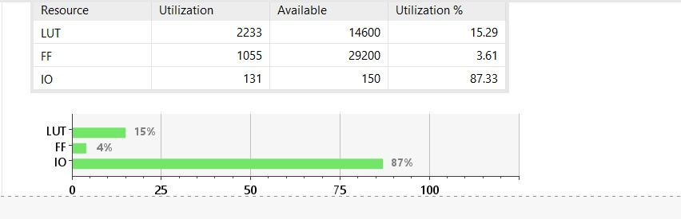
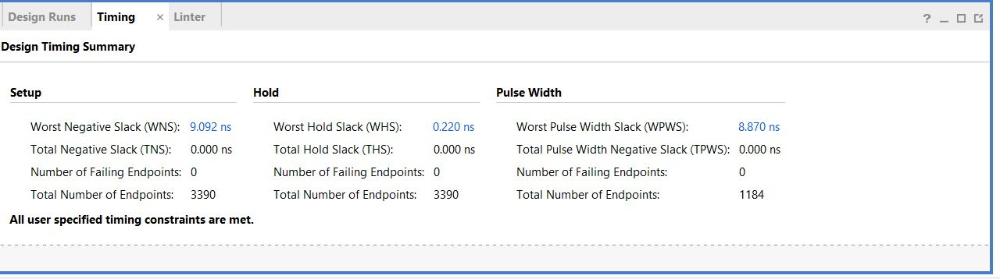
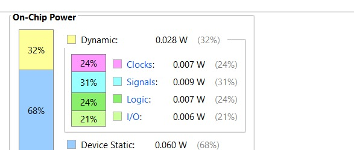
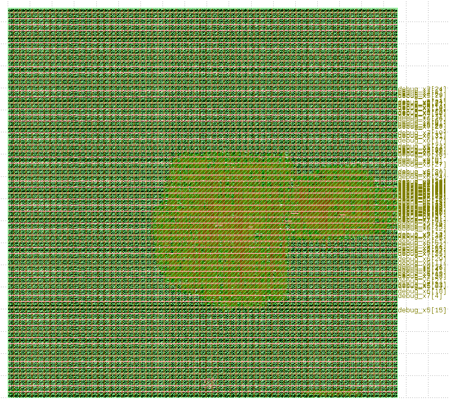

# RISC-V CPU

### 32-bit Single-Cycle RISC-V Processor | Verilog RTL | FPGA + ASIC

A 32-bit single-cycle RISC-V processor designed and implemented in Verilog HDL, verified through simulation, and taken through both FPGA implementation and the complete RTL-to-GDS ASIC flow.

The processor supports **36 RV32I-style instructions** and includes a program counter, instruction memory, register file, ALU, control unit, data memory, immediate-generation logic, and debug outputs.

## Project Overview

This project was developed to understand the complete digital-design flow, from writing processor RTL to generating and inspecting the final ASIC layout.

```text
Verilog RTL
    ↓
RTL Simulation
    ↓
FPGA Implementation
    ↓
ASIC Synthesis
    ↓
Floorplanning
    ↓
Placement
    ↓
Clock Tree Synthesis
    ↓
Routing
    ↓
Timing / DRC / Antenna Checks
    ↓
GDSII
```

## CPU Architecture

The processor uses a single-cycle datapath, where each instruction is executed within one clock cycle.

```text
                  ┌──────────────────┐
                  │ Program Counter  │
                  └────────┬─────────┘
                           ↓
                  ┌──────────────────┐
                  │ Instruction      │
                  │ Memory           │
                  └────────┬─────────┘
                           ↓
                  ┌──────────────────┐
                  │ Control Unit /   │
                  │ Decoder          │
                  └────────┬─────────┘
                           ↓
             ┌─────────────┴─────────────┐
             ↓                           ↓
    ┌──────────────────┐       ┌──────────────────┐
    │ Register File    │       │ Immediate        │
    │                  │       │ Generator        │
    └────────┬─────────┘       └────────┬─────────┘
             └─────────────┬────────────┘
                           ↓
                  ┌──────────────────┐
                  │ ALU              │
                  └────────┬─────────┘
                           ↓
                  ┌──────────────────┐
                  │ Data Memory /    │
                  │ Write-Back       │
                  └──────────────────┘
```

## Features

- 32-bit single-cycle RISC-V processor
- Support for 36 RV32I-style instructions
- Arithmetic, logical, shift, branch, jump, and memory operations
- Separate ALU, decoder, and register-file modules
- Synthesizable Verilog RTL
- Debug outputs for observing internal signals
- Simulation using Icarus Verilog and Verilator
- Waveform analysis using GTKWave
- FPGA synthesis and implementation using Vivado
- ASIC synthesis and physical design using open-source tools
- Final GDSII generation and layout inspection

## Supported Instructions

The processor supports the following instruction categories:

| Category | Instructions |
|----------|--------------|
| Arithmetic | ADD, SUB, ADDI |
| Logical | AND, OR, XOR, ANDI, ORI, XORI |
| Comparison | SLT, SLTU, SLTI, SLTIU |
| Shift | SLL, SRL, SRA, SLLI, SRLI, SRAI |
| Memory | LW, SW |
| Branch | BEQ, BNE, BLT, BGE, BLTU, BGEU |
| Jump | JAL, JALR |
| Upper Immediate | LUI, AUIPC |

## RTL Design and Verification

The CPU was implemented in Verilog and verified using simulation tools.

### Verification Tools

- Icarus Verilog
- Verilator
- GTKWave

The testbench was used to check instruction execution, ALU operations, register read/write behavior, program-counter updates, reset behavior, and internal debug signals.

## FPGA Implementation

The CPU was synthesized and implemented using **Xilinx Vivado**.

### FPGA Results

| Parameter | Result |
|----------|-------:|
| LUTs | 2,233 |
| Flip-Flops | 1,055 |
| Clock Constraint | 20 ns |
| Timing | Clean |
| Estimated Power | 0.088 W |

### Resource Utilization



The design used approximately **15.29% LUTs** and **3.61% flip-flops**.

### Timing Analysis



| Parameter | Result |
|----------|-------:|
| Worst Negative Slack | 9.092 ns |
| Total Negative Slack | 0.000 ns |
| Worst Hold Slack | 0.220 ns |
| Total Hold Slack | 0.000 ns |
| Failing Endpoints | 0 |

### Power Analysis



| Power Component | Power |
|----------------|------:|
| Device Static | 0.060 W |
| Dynamic | 0.028 W |
| Total Power | 0.088 W |

## ASIC Implementation

The processor was taken through the complete **RTL-to-GDS ASIC flow** using the Sky130HD standard-cell library.

### ASIC Toolchain

| Tool | Purpose |
|------|---------|
| Yosys | RTL synthesis |
| OpenROAD | Floorplanning, placement, CTS, and routing |
| Sky130HD | Standard-cell library |
| Magic | Layout inspection and verification |
| KLayout | GDSII visualization |

### ASIC Flow

```text
Verilog RTL
    ↓
Yosys Synthesis
    ↓
OpenROAD Floorplan
    ↓
Placement
    ↓
Clock Tree Synthesis
    ↓
Routing
    ↓
Timing Analysis
    ↓
DRC / Antenna Checks
    ↓
GDSII
```

### ASIC Floorplan



The final layout was successfully generated and inspected in KLayout.

### Final ASIC Results

| Parameter | Result |
|----------|-------:|
| Core Area | 90,238 µm² |
| Core Area | 0.090238 mm² |
| Utilization | 12% |
| Estimated Total Power | 6.12 mW |
| Setup Violations | 0 |
| Hold Violations | 0 |
| DRC Violations | 0 |
| Antenna Violations | 0 |

### Final ASIC Outputs

```text
6_final.gds
6_final.def
6_final.v
6_final.spef
6_final.sdc
```

## Repository Structure

```text
RISC-V-CPU/
│
├── README.md
├── alu.v
├── decoder.v
├── register_file.v
├── riscv_cpu.v
├── riscv_cpu_synth.v
├── riscv_cpu_synth_tb.v
│
├── cpu_synth.vp
├── schematic.sch
├── Notes/
└── images/
    ├── floorplan.png
    ├── power.png
    ├── timing.png
    └── utilization.png
```

## Simulation

### Compile

```bash
iverilog -g2012 -s riscv_cpu_synth_tb -o sim.out \
riscv_cpu_synth.v \
riscv_cpu_synth_tb.v \
alu.v \
decoder.v \
register_file.v
```

### Run

```bash
vvp sim.out
```

### View Waveforms

```bash
gtkwave dump.vcd
```

## What I Learned

- RISC-V instruction formats and CPU architecture
- Single-cycle datapath and control logic
- Verilog RTL design and verification
- FPGA synthesis and timing analysis
- Standard-cell ASIC design
- Floorplanning, placement, CTS, and routing
- Static timing analysis
- DRC and antenna verification
- GDSII generation
- OpenROAD and Tcl-based physical design

## Future Work

- Improve automated verification
- Add more RISC-V instructions
- Implement the CPU on an FPGA board
- Develop a 5-stage pipelined RISC-V CPU
- Add forwarding and hazard detection
- Improve timing and resource utilization

## Author

**Chirag Bhalla**

Electronics and Communication Engineering

Interested in Embedded Systems, FPGA, RTL Design, VLSI, and Computer Architecture.
